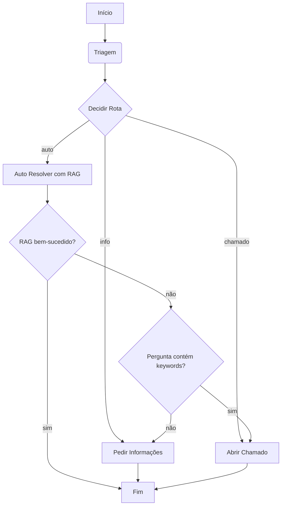

# 🤖 Agente de Service Desk com RAG e LangGraph (Imersão Alura + Google)

Este repositório contém o projeto desenvolvido durante a **Imersão Agentes de IA**, uma parceria entre a **Alura** e o **Google**. O objetivo é construir um agente de Service Desk autônomo, capaz de responder a perguntas sobre políticas internas de uma empresa fictícia, utilizando o poder do modelo de linguagem Gemini e as ferramentas do ecossistema LangChain.

## 📜 Sobre o Projeto

O agente foi projetado para atuar como a primeira linha de suporte, automatizando a triagem e a resolução de dúvidas comuns de colaboradores. Ele utiliza a técnica de **RAG (Retrieval-Augmented Generation)** para basear suas respostas estritamente em um conjunto de documentos de políticas internas (arquivos PDF), garantindo que as informações sejam precisas e contextuais.

O fluxo de decisão do agente é orquestrado de forma inteligente usando **LangGraph**, que permite a criação de um grafo de estados para lidar com diferentes tipos de solicitações.

## ✨ Funcionalidades Principais

* **Triagem Automática:** Classifica as perguntas dos usuários em três categorias:
    * `AUTO_RESOLVER`: Perguntas diretas que podem ser respondidas com a base de conhecimento.
    * `PEDIR_INFO`: Perguntas vagas que necessitam de mais detalhes.
    * `ABRIR_CHAMADO`: Solicitações de exceção ou pedidos que exigem ação humana.
* **Respostas Baseadas em Documentos (RAG):**
    * Carrega e processa múltiplos documentos PDF como base de conhecimento.
    * Utiliza embeddings do Gemini para vetorizar os textos e o FAISS para buscas de similaridade.
    * Responde às perguntas citando a fonte (documento e página) de onde a informação foi extraída.
* **Fluxo de Decisão com LangGraph:**
    * Implementa um grafo de estados que direciona a conversa de forma lógica.
    * Se uma tentativa de `AUTO_RESOLVER` falhar, o agente pode reavaliar e pedir mais informações ou abrir um chamado.
* **Abertura Simulada de Chamados:** Para solicitações que não podem ser auto-resolvidas, o agente simula a abertura de um ticket de suporte com a urgência apropriada.

## フローチャート Fluxo do Agente

O agente opera seguindo um grafo de estados definido com LangGraph, garantindo um fluxo de trabalho robusto e previsível.



## 🛠️ Tecnologias Utilizadas

* **Linguagem:** Python
* **LLM:** Google Gemini 1.5 Flash
* **Frameworks:**
    * LangChain: para orquestração geral do agente.
    * LangGraph: para criar o fluxo de estados do agente.
* **Vetorização e Busca:**
    * Google Generative AI Embeddings
    * FAISS (Facebook AI Similarity Search): para o banco de dados vetorial.
* **Manipulação de Dados:**
    * PyMuPDF: para carregar o conteúdo dos arquivos PDF.
    * Pydantic: para definir e validar estruturas de dados.

## 🚀 Como Executar

Siga os passos abaixo para configurar e executar o projeto localmente.

### 1. Pré-requisitos

* Python 3.9 ou superior
* Git

### 2. Clone o Repositório

```bash
git clone [https://github.com/seu-usuario/seu-repositorio.git](https://github.com/seu-usuario/seu-repositorio.git)
cd seu-repositorio
```

### 3. Crie um Ambiente Virtual e Instale as Dependências

É uma boa prática usar um ambiente virtual para isolar as dependências do projeto.

```bash
# Criar ambiente virtual
python -m venv venv

# Ativar o ambiente (Windows)
.\venv\Scripts\activate

# Ativar o ambiente (Linux/macOS)
source venv/bin/activate
```

Crie um arquivo chamado `requirements.txt` com o seguinte conteúdo:

```txt
langchain
langchain-google-genai
google-generativeai
langchain_community
faiss-cpu
langchain-text-splitters
pymupdf
requests
langgraph
python-dotenv
ipykernel
jupyter
```

Em seguida, instale as bibliotecas:

```bash
pip install -r requirements.txt
```

### 4. Configure sua Chave de API

1.  Obtenha sua chave de API do Google Gemini em [Google AI Studio](https://aistudio.google.com/app/apikey).
2.  Crie um arquivo chamado `.env` na raiz do projeto.
3.  Adicione sua chave de API ao arquivo `.env`:

```env
GEMINI_API_KEY="SUA_CHAVE_DE_API_AQUI"
```

### 5. Adicione os Documentos

1.  Crie uma pasta chamada `documentos` na raiz do projeto.
2.  Coloque os arquivos PDF que servirão como base de conhecimento dentro desta pasta.

### 6. Execute o Notebook

Com o ambiente virtual ativado, inicie o Jupyter Notebook:

```bash
jupyter notebook Imersão_Agentes_de_IA_Alura_+_GEMINI_.ipynb
```

Siga as células do notebook para executar o agente.

## 📁 Estrutura do Projeto

```
.
├── documentos/
│   ├── politica_de_reembolso.pdf
│   └── ... (outros arquivos PDF)
├── .env
├── requirements.txt
├── README.md
└── Imersão_Agentes_de_IA_Alura_+_GEMINI_.ipynb
```

## 🙏 Agradecimentos

Este projeto é resultado do conteúdo apresentado na **Imersão Agentes de IA**, uma iniciativa da **Alura** em parceria com o **Google**.
